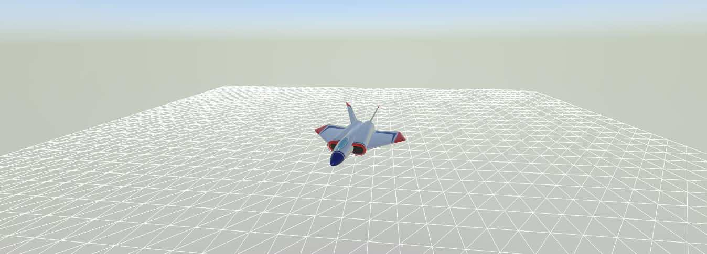
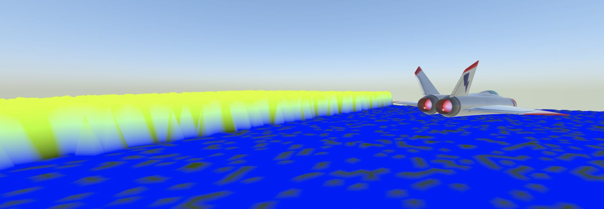

# MFGridMeshLab

A demo app that demonstrates the **MFGridMeshNode** object, based on the Apple **SceneKit** sample.

**MFSCNGridNode** is defined in the **MFSCNExtensions** package.

<https://github.com/moosefactory/MFSCNExtensions>

## Discussion

The code is slightly modified to insert a mesh under the rotating plane.

### 1 - Create a mesh object



```

// Add a mesh node ( must import MFSCNExtension and MFGridUtils )

// 1 - Create a grid object
let grid = MFGrid(gridSize: 40, cellSize: 2)

// 2 - Create a mesh using the grid
let meshNode = MFSCNGridMeshNode(grid: grid)

// 3 - Slightly move the mesh down so wee see it in perspective
meshNode.position.y = -3.0

scene.rootNode.addChildNode(meshNode)
sceneRenderer.scene = scene

```

Build and run.

### 2 - Add some depth and color

#### Height function.

```
// It basically makes a linear clif with a bit of variation
// So in one case a height of 4 with a bit of random is returned,
// in the other case, we are at sea level, with a bit of random two to give a bit of waves effect

let heightBlock: MFSCNHeightComputeBlock = { _, loc, locp in
    if (loc.h < Int(Double.random(3)) + loc.v / 2) {
        return 4.0 + Double.random(1.2)
    }
    return Double.random(0.25)
}
```

#### Color function



```
// We choose blue if the level is 0, else we use a mixed red/green color

let colorBlock: MFSCNColorComputeBlock = { value, gridLoc, location, vertice in

    if vertice.z > 0.2 {
        return SCNVector4(x: vertice.z / 7, y: vertice.z / 3, z: 0, w: 1)
    } else {
        return SCNVector4(x: 0, y: 0, z: 1, w: 1)
    }
}
```

### Mesh creation

```
let meshNode = MFSCNGridMeshNode(grid: grid,
                                 heightComputeBlock: heightBlock,
                                 colorComputeBlock: colorBlock)

```

--

*©2024 Moose Factory Software*
